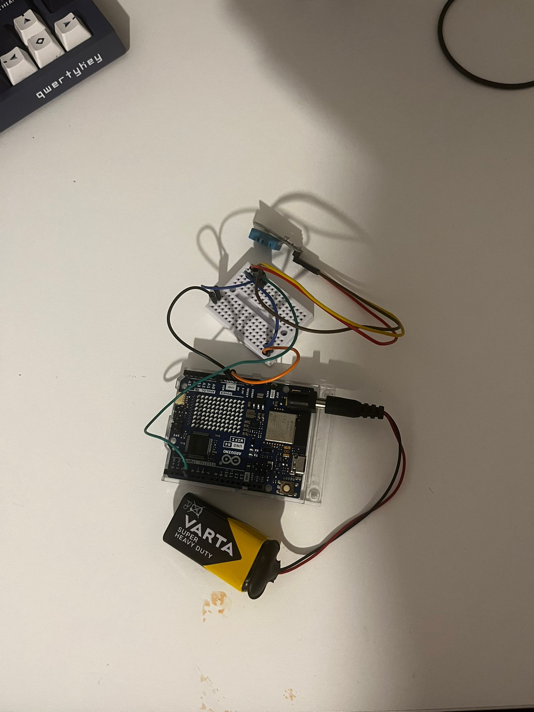

# Blockchain Logger for Temperature and Humidity with WiFi

A project that logs temperature and humidity data from a DHT11 sensor into a local mini-blockchain, running on a WiFi-enabled microcontroller, synchronized with NTP and accessible via a web server.

## Implemented Features

- **WiFi Connection:** Automatically connects to the predefined network using a password.
- **NTP Time Sync:** Uses NTPClient to fetch the current time.
- **Temperature/Humidity Reading:** Uses the DHT11 sensor.
- **Local Blockchain:**
  - Each block contains: index, timestamp, temperature, humidity, previous block’s hash, and its own hash.
  - Genesis block is generated at initialization.
  - New blocks are created every 60 seconds.
- **HTTP Server:** Displays the blockchain content through a text-based interface accessible via a browser.

## Physical Setup Image

## Simulation

[Wokwi Open Simulation](https://wokwi.com/projects/433145545452796929)

## Implementation Details

- **computeHash()** – computes the SHA256 hash of a block.
- **createGenesisBlock()** – creates the initial block with default values.
- **createNewBlock()** – reads sensor data, creates a new block, and appends it to the blockchain.
- **printBlockchain()** – sends the blockchain data over the HTTP connection.

## Issues Encountered and Solutions

- **Issue:** Unstable network connection  
  **Solution:** Retry connection every 5 seconds until successful.
- **Issue:** DHT11 returns NaN  
  **Solution:** Check with `isnan()` and ignore invalid readings.
- **Issue:** Incorrect time due to NTP delay  
  **Solution:** Call `timeClient.forceUpdate()` at initialization.

## Related Projects

- [Blockchain for environmental condition verification in pharmaceutical transport](https://www.mdpi.com/1424-8220/20/14/3951)
- [IoT Blockchain framework for smart supply chain monitoring](https://www.researchgate.net/publication/383369060_Blockchain-Assisted_IoT_Wireless_Framework_for_Equipment_Monitoring_in_Smart_Supply_Chain_A_Focus_on_Temperature_and_Humidity_Sensing)
- [Blockchain-integrated BIoT system for indoor temperature control](https://www.sciencedirect.com/science/article/pii/S0926580522002126)
